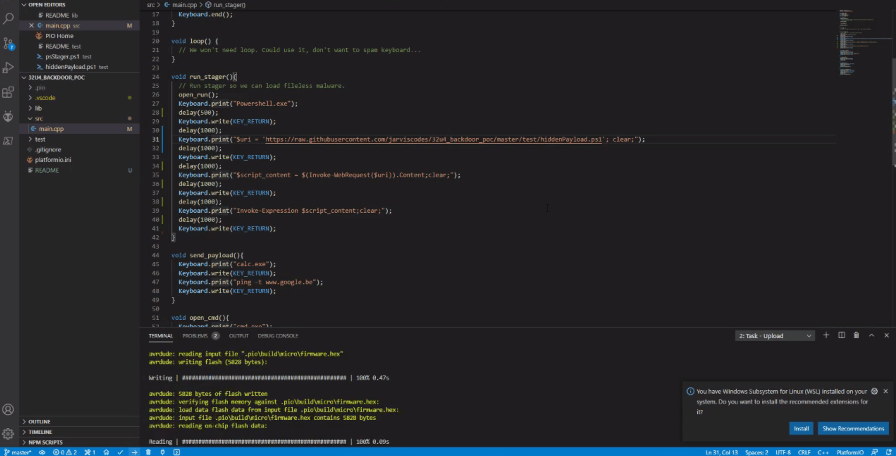

## 32u4 backdoor PoC is ...

A hardware-based backdoor stager PoC for atmega32u4 on Windows.

Note that with the current headers, it is compiled to only work against Azerty Keymap.
It can easily be ported back to QWERTY by using the original Arduino `Keyboard.h` and `Keyboard.cpp`.

### How?
Atmega32u4 can natively interface as a HID. 
By pretending to be a keyboard and simulating keystrokes, we open the Run menu and subsequently powershell.

Next we stage the malware by calling `Invoke-Webrequest` and storing it's `.Content`.
Finally, we can execute the code by calling `Invoke-Expression`.

This causes the "malware" to never be on disk, but only to exist in Memory / on the C2.

After it's done compiling it will take 15 seconds to kickstart the malware to give Windows some time to load the HID drivers etc.
Here's what happens next:

Note that this does not require any ugly `-ExecutionPolicy permissive` flags or the like, just a C2 hosting the PS Script.